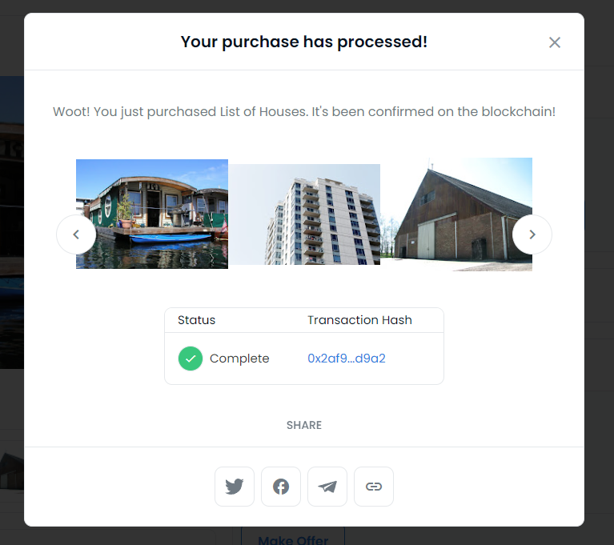

# Capstone: Real Estate Marketplace

Final project for the Blockchain Developer nanodegree program (Udacity) 

## How to test this project

This project is created using Truffle so the execution of tests is as simple as
'_truffle test_' or _test_ inside the develop environment (_truffle develop_)

There are three files of tests:
1. TestRealEstateMarket.js => Tests about custom implementation of ERC721
    - The contract to test is RealEstateMarket.sol
2. TestSquareVerifier.js => Tests about the generated contract from Zokrates (an implementation of zkSnarks proof validation)
    - The contract to test is verifier.sol
3. TestSolnSquareVerifier.js => Tests about unifying the custom implementation of ERC721 and the zkSnarks contract implementation
    - The contract to test is SolnSquareVerifier.sol

## Deployement

This project is deployed on Rinkeby test network

| Contract | Address |
|----------|---------|
| Verifier.sol |  0x57966Cf356185276eD701b90f458b6EcB371F825
| SolnSquareVerifier | 0xE211830bA3B5FB6b4bcAF5134adEca3334539C81

### Contract ABIs

You can either generate the contracts ABIs by compiling the source code or you cen get them on */ABI* folder at the root of this repository.  

### How to mint tokens in testnet

There is a simple WebApp to mint new tokens easily. 

npm run serve and access it from localhost:8080

There you need to load the contract.json file (the generated after compiling from truffle) and the address.

After that you only need to give a solution Id and token Id to follow the process to mint a new NFT.

## OpenSea

The storefront of all tokens created can be viewed here:

https://testnets.opensea.io/collection/unidentified-contract-1tktubaxmo

An example transaction of a bundle of 5 houses has been made on  

https://testnets.opensea.io/bundles/list-of-houses-jGW

And as you can see on the following picture, it is working as expected.

# Project Resources

* [Remix - Solidity IDE](https://remix.ethereum.org/)
* [Visual Studio Code](https://code.visualstudio.com/)
* [Truffle Framework](https://truffleframework.com/)
* [Ganache - One Click Blockchain](https://truffleframework.com/ganache)
* [Open Zeppelin ](https://openzeppelin.org/)
* [Interactive zero knowledge 3-colorability demonstration](http://web.mit.edu/~ezyang/Public/graph/svg.html)
* [Docker](https://docs.docker.com/install/)
* [ZoKrates](https://github.com/Zokrates/ZoKrates)
